# 유지보수 및 인수인계 문서

## 목차
- [1. 문서 안내](#1-문서-안내)
- [2. 전체 구조](#2-전체-구조)
- [3. 화면과 컴포넌트](#3-화면과-컴포넌트)
- [4. 핵심 파일과 기능](#4-핵심-파일과-기능)
- [5. 함수 계약(입력-처리-반환-부수효과)](#5-함수-계약입력-처리-반환-부수효과)
- [6. 동작 흐름도](#6-동작-흐름도)
- [7. 역할 관계도](#7-역할-관계도)
- [8. API 매핑](#8-api-매핑)
- [9. DB 스키마](#9-db-스키마)
- [10. ERD](#10-erd)
- [11. 유지보수 절차](#11-유지보수-절차)
- [12. 증상별 문제 진단](#12-증상별-문제-진단)
- [13. 검수 결과](#13-검수-결과)

---

## 1. 문서 안내

| 항목 | 내용 |
|---|---|
| 대상 | 프로젝트를 처음 맡는 개발자 |
| 활용 방법 | 화면에서 시작해 API, 서비스, DB 필드까지 추적 |
| 읽는 순서 | 문서 안내 → 화면/컴포넌트 → API/함수 계약 → DB/ERD → 유지보수/장애 대응 |
| 적용 범위 | 프런트엔드(Vue 3), 백엔드(Spring Boot), 데이터베이스(PostgreSQL 설정 + schema.sql), 운영 절차 |
| 캡처 기준 | 실제 실행 시도 후 실패하여 `코드 기반 재구성 · 설명용 데이터` 이미지 사용 |

실행 시도 결과: `Ai-Diary-vue` 실행 중 `src/page/ConfirmPassword2.vue` 파일 경로 불일치로 Vite 의존성 스캔 실패(라우터는 `ConfirmPassword2.vue` 참조, 실제 파일은 `confirmPassword2.vue`).

---

## 2. 전체 구조

- 프런트엔드는 Vue Router 기반 페이지(`src/page`)와 재사용 컴포넌트(`src/components`)로 구성되고, `axiosInstance`가 공통 인증 헤더와 401 재시도를 처리합니다.
- 백엔드는 `AuthController`, `DiaryController`, `KakaoController`, `TimeController`가 API 진입점을 제공하고, `AuthService/DiaryService/KakaoService`가 핵심 로직을 수행합니다.
- 데이터는 JPA 엔티티(`users`, `diary`, `refresh_token`) 중심으로 읽고 쓰며, `schema.sql`에는 추가 테이블(`email_verification`, `chats`, `diary_views`, `webrtc_connections`)이 정의되어 있습니다.

데이터 이동(요약):
`화면 입력 -> axiosInstance -> Controller -> Service -> Repository/JPA -> DB -> JSON 응답 -> 화면 렌더`

---

## 3. 화면과 컴포넌트

### 3.1 홈/인증 화면

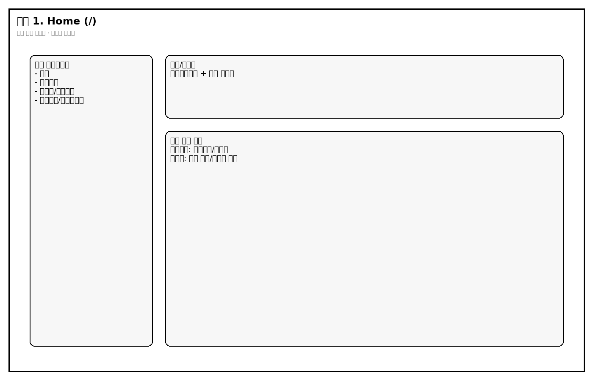
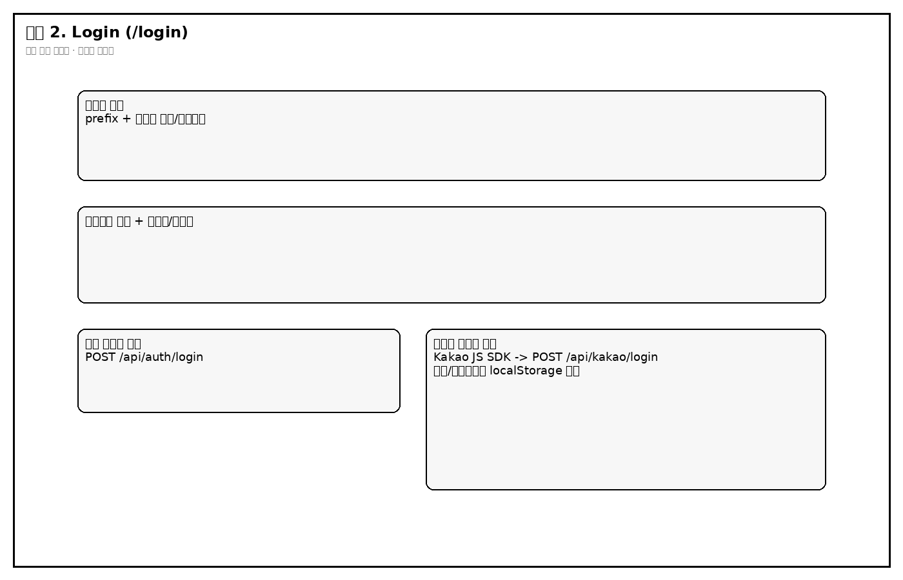
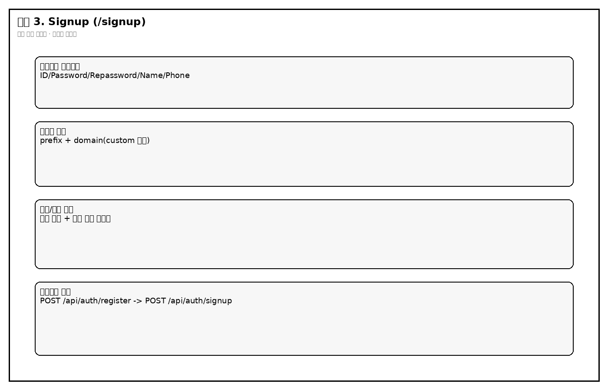
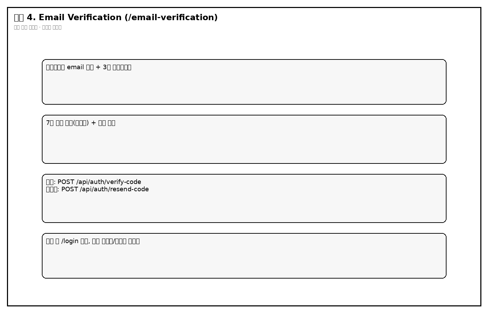

- **Home(`/`)**: 로그인 상태(localStorage)에 따라 CTA 버튼이 달라지며, 비로그인은 로그인/튜토리얼로, 로그인 사용자는 작성/목록으로 이동합니다.
- **Login(`/login`)**: 일반 로그인과 카카오 로그인을 모두 제공하고 성공 시 토큰과 사용자 식별값을 localStorage에 저장합니다.
- **Signup(`/signup`)**: 입력 검증 후 회원 생성 요청을 보내고, 이어서 이메일 인증코드 전송 API를 호출합니다.
- **Verification(`/email-verification`)**: 3분 타이머 안에 코드 확인을 수행하며 실패/만료 시 재전송 경로로 분기합니다.

### 3.2 다이어리 화면

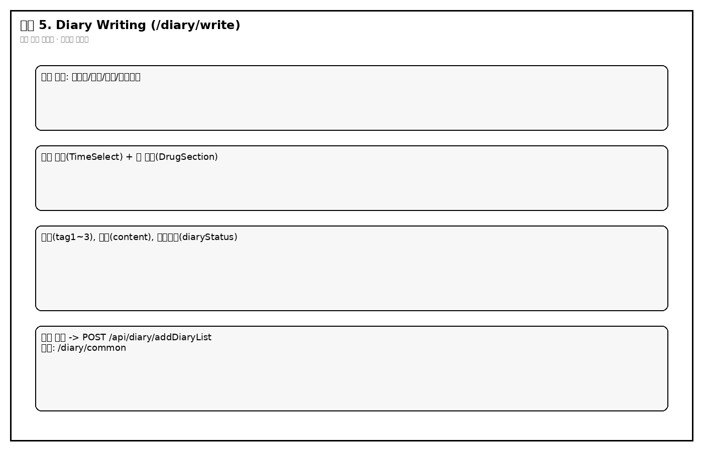
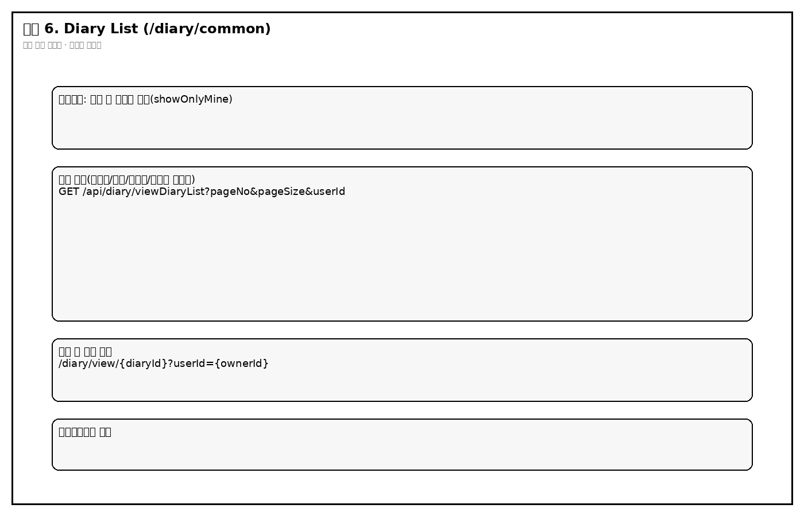
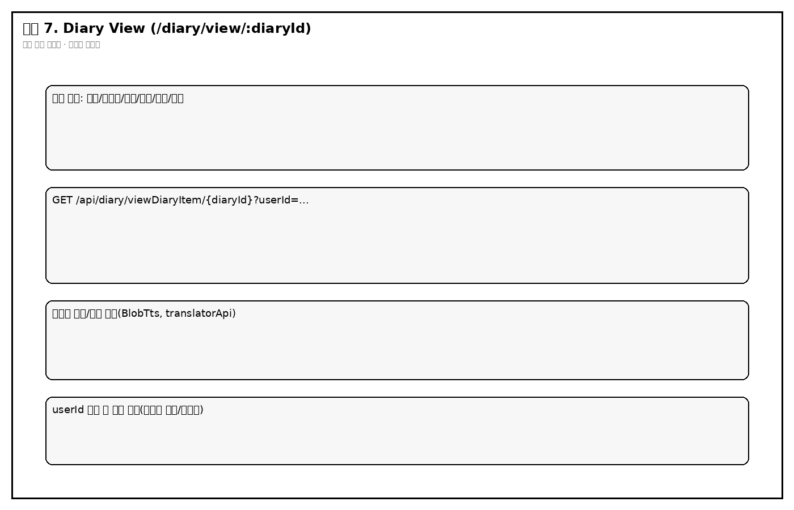

- **DiaryWriting(`/diary/write`)**: 날짜/작성자/제목/감정 필수 검증 후 일기를 저장하며, 수면 시간/약 복용 정보를 함께 전송합니다.
- **DiaryList(`/diary/common`)**: 공개/비공개와 내 글 필터를 조합해 목록을 보여주고 페이지네이션을 처리합니다.
- **DiaryView(`/diary/view/:diaryId`)**: `diaryId + userId` 조합으로 상세를 조회하고 태그/감정/번역 기능을 연결합니다.

### 3.3 포모도로 화면

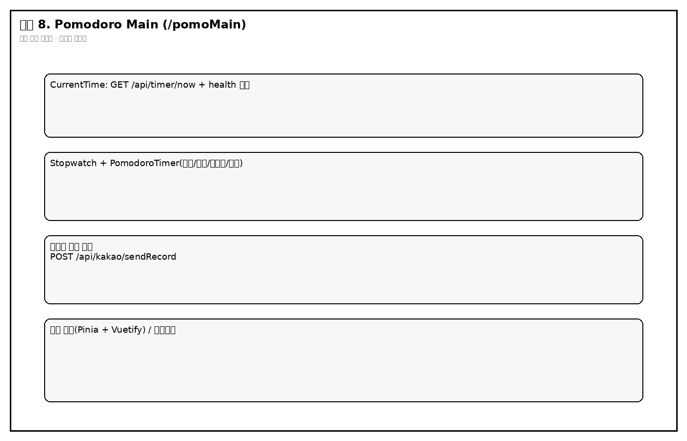

- **pomoLogin/pomoMain**: 카카오 로그인 후 스탑워치/포모도로 기록을 만들고 카카오 나에게 보내기로 전송합니다.

---

## 4. 핵심 파일과 기능

| 영역 | 파일 | 책임 | 핵심 기능(1~2문장) |
|---|---|---|---|
| 라우팅 | `Ai-Diary-vue/src/router/index.js` | 페이지 매핑 | 인증/다이어리/포모도로 라우트를 연결하며 일부 보호 로직을 beforeEach에서 처리합니다. |
| API 클라이언트 | `Ai-Diary-vue/src/unit/axiosInstance.js` | 공통 HTTP 정책 | 토큰 우선순위(jwt/access/kakao)를 Authorization에 주입하고, 401 시 refresh API로 재발급 후 원요청을 재시도합니다. |
| 로그인 UI | `Ai-Diary-vue/src/page/LoginPage.vue` | 사용자 로그인 입력/분기 | 일반 로그인과 카카오 SDK 로그인 흐름을 분리 처리하고 성공 시 localStorage를 갱신합니다. |
| 회원가입 UI | `Ai-Diary-vue/src/page/SignupPage.vue` | 계정 생성 + 코드 전송 | 로컬 검증 후 register 호출, 성공 시 signup 호출로 이메일 인증 코드를 보냅니다. |
| 일기 작성 UI | `Ai-Diary-vue/src/page/DiaryWriting.vue` | 일기 입력/저장 | 필수값 검증과 공개설정, 태그, 수면/복약 정보를 한 요청으로 묶어 저장 API에 전달합니다. |
| 일기 목록 UI | `Ai-Diary-vue/src/page/DiaryList.vue` | 목록/필터/페이징 | 서버 페이지네이션 응답을 받아 비공개 정책과 내 글 필터를 화면에서 최종 반영합니다. |
| 일기 상세 UI | `Ai-Diary-vue/src/page/DiaryView.vue` | 상세 조회/표시 | 라우트 파라미터를 사용해 상세 일기를 조회하고 감정 텍스트/태그/번역 표시를 구성합니다. |
| 인증 API | `Ai-Diary-server/.../controller/AuthController.java` | 회원/토큰 엔드포인트 | 로그인, 가입, 인증코드 확인/재전송, 탈퇴, 비밀번호 변경, 토큰 재발급 API를 제공합니다. |
| 인증 서비스 | `Ai-Diary-server/.../service/AuthService.java` | 인증 비즈니스 | 이메일/비밀번호 검증, 인증코드 생성/메일 발송, 탈퇴/비밀번호 변경 로직을 수행합니다. |
| 다이어리 API | `Ai-Diary-server/.../controller/DiaryController.java` | 일기 조회/저장 | 목록/상세 조회와 작성 요청의 사용자 일치성 검증 및 응답 조립을 담당합니다. |
| 다이어리 서비스 | `Ai-Diary-server/.../service/DiaryService.java` | 다이어리 도메인 로직 | 리스트 페이징 변환, 상세 조회, 엔티티 생성 및 저장을 수행합니다. |
| 카카오 API | `Ai-Diary-server/.../controller/KakaoController.java` | 소셜 로그인/카톡 전송 | 카카오 access token으로 사용자 정보를 조회하고 내부 JWT를 발급하거나 기록 메시지를 카카오 API로 전달합니다. |
| 보안 필터 | `Ai-Diary-server/.../util/JwtAuthenticationFilter.java` | 요청 인증 컨텍스트 구성 | ****** 검증해 SecurityContext에 `CustomUserDetails`를 주입합니다. |
| 토큰 유틸 | `Ai-Diary-server/.../util/JwtUtil.java` | JWT 발급/검증 | access/refresh 토큰 생성, refresh_token 저장, 토큰 검증/재발급을 처리합니다. |
| 데이터 모델 | `Ai-Diary-server/.../user/domain/User.java`, `.../diary/domain/Diary.java` | DB 매핑 | 사용자/일기 컬럼과 엔티티 라이프사이클(`@PrePersist`)을 정의합니다. |

---

## 5. 함수 계약(입력-처리-반환-부수효과)

| 화면 요소 | 함수/메서드 | 입력 | 처리 조건 | 반환값 | 부수 효과 |
|---|---|---|---|---|---|
| 로그인 버튼 | `LoginPage.onClickLoginButton` | email, password | 둘 중 하나라도 비면 즉시 경고 | 성공/실패 알림 | localStorage 토큰/사용자값 저장, `/diary/common` 이동 |
| 카카오 로그인 버튼 | `LoginPage.kakaoLogin` | Kakao SDK access token | SDK 미초기화면 중단 | access/refresh + kakaoUserInfo | localStorage 갱신, 라우팅 이동 |
| 회원가입 전송 버튼 | `SignupPage.sendVerificationCode` | signUpData | 이메일 형식/중복 검증 실패 시 중단 | 인증코드 전송 성공 메시지 | `/email-verification` 이동 |
| 코드 확인 버튼 | `VerificationPage.checkCode` | email(query), 7자리 code | 코드 불일치/만료 시 실패 분기 | 인증 성공/실패 메시지 | 성공 시 `/login` 이동 |
| 저장 버튼 | `DiaryWriting.onClickSaveDiary` | diaryData(제목/본문/태그/감정/시간/복약) | 필수값 누락 시 저장 중단 | `{success:true}` 기대 | 일기 저장, 성공 알림 후 목록 이동 |
| 목록 로드 | `DiaryList.fetchDiaryList` | pageNo, pageSize, showOnlyMine | 빈목록/오류 시 메시지 분기 | `diaryList,total,page,pageSize` | 화면 필터링(비공개 + 작성자 조건) |
| 상세 로드 | `DiaryView.getDiaryItem` | diaryId(path), userId(query) | 둘 중 하나라도 없으면 호출 중단 | `diaryItem` | 상세 화면 상태 갱신 |
| 로그인 API | `AuthController.login -> AuthService.login` | `LoginRequest{email,password}` | 사용자 미존재/미인증/비번불일치 시 예외 | `accessToken,refreshToken` | refreshToken 쿠키 발급 + refresh_token 테이블 저장 |
| 토큰 재발급 API | `AuthController.refresh` | refreshToken(cookie) | 쿠키 없음/만료/DB불일치 시 401 | `newAccessToken` | 없음(재로그인 유도 가능) |
| 일기 저장 API | `DiaryController.addDiaryList -> DiaryService.addDiary` | `DiaryRequest` + Authorization | 로그인 사용자 email과 요청 email 불일치 시 403 | `{success:true}` | diary insert, IP/selected_times/drug_* 저장 |
| 일기 상세 API | `DiaryController.viewDiaryItem` | diaryId + userId + Authorization | userId 누락/토큰 오류 시 실패 | `Optional<Diary>` 래핑 응답 | 없음 |
| 카카오 기록 전송 | `KakaoController.sendRecord` | Authorization(JWT), body(kakaoAccessToken, stopwatch/pomodoro) | 토큰 누락/카카오 조회 실패 시 401 | 성공/실패 메시지 | 카카오톡 나에게 보내기 API 호출 |

---

## 6. 동작 흐름도

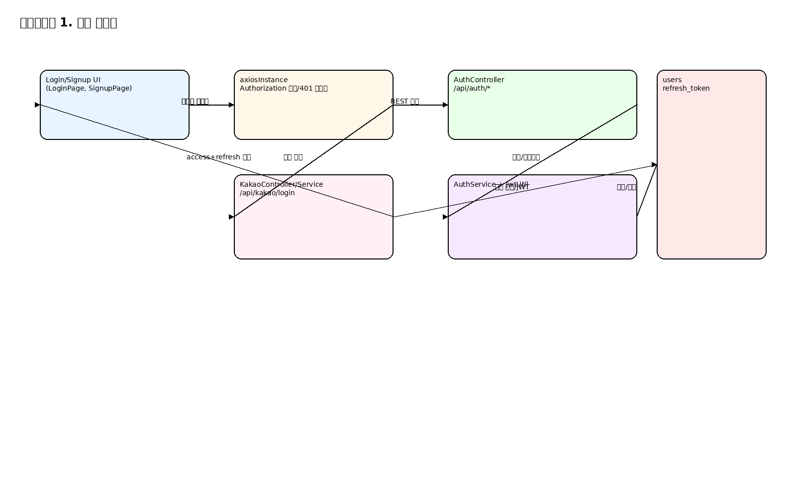
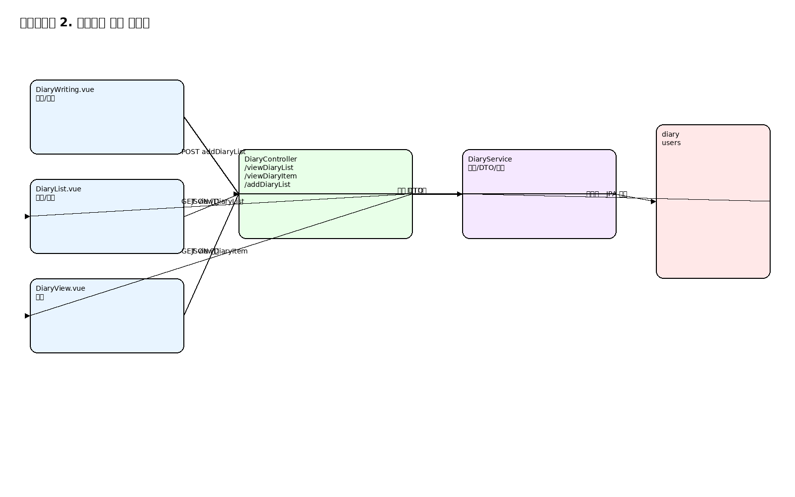

### 6.1 인증 분기 핵심
1. 로그인 요청 수신.
2. 사용자 조회 실패 또는 비밀번호/인증상태 실패면 즉시 에러 반환.
3. 성공 시 access/refresh 발급 후 refresh는 HttpOnly 쿠키로 반환.
4. 이후 API 401 발생 시 프런트가 `/api/auth/refresh` 호출.
5. refresh 성공이면 원요청 재시도, 실패면 localStorage 정리 후 로그인 이동.

### 6.2 다이어리 분기 핵심
1. 목록 조회는 `showOnlyMine`에 따라 `userId` 파라미터 분기.
2. 서버 응답 후 프런트에서 `diaryStatus`와 작성자 ID를 다시 필터링.
3. 상세 조회는 `diaryId + userId` 둘 다 필요하며 누락 시 조기 종료.
4. 저장은 필수값 검증 실패 시 조기 종료, 성공 시 목록 화면으로 이동.

---

## 7. 역할 관계도

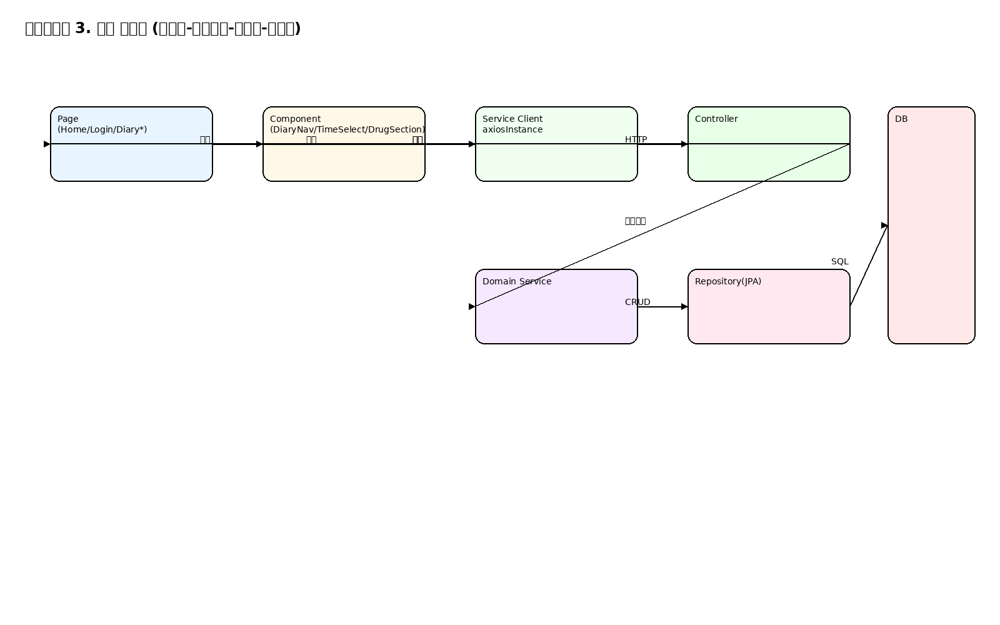

화살표 의미:
- `Page -> Component`: 화면 구성 및 사용자 이벤트 수집.
- `Component/Page -> Service Client`: API 요청 생성.
- `Controller -> Service`: 도메인 규칙 적용.
- `Service -> Repository -> DB`: 영속화 처리.
- `Controller -> Page`: JSON 응답으로 렌더링 갱신.

---

## 8. API 매핑

| 화면 | API | 메서드 | 요청 필드 | 응답 필드 | 연결 DB |
|---|---|---|---|---|---|
| 로그인 | `/api/auth/login` | POST | `email`, `password` | `accessToken`, `refreshToken` | `users`, `refresh_token` |
| 카카오 로그인 | `/api/kakao/login` | POST | `accessToken` | `accessToken`, `refreshToken`, `kakaoUserInfo` | `users`, `refresh_token` |
| 회원가입 | `/api/auth/register` | POST | `userId`, `username`, `password`, `phone`, `email` | 성공 메시지 | `users` |
| 인증코드 발송 | `/api/auth/signup` | POST | body:`email`, params:`message` | message/email | (코드상 Map/메일 전송, 사용자 verify 연동) |
| 인증코드 확인 | `/api/auth/verify-code` | POST | `email`, `code` | 성공/실패 문자열 | `users.verification_code`, `users.verifyYn` |
| 코드 재전송 | `/api/auth/resend-code` | POST | `email` | 성공/실패 문자열 | `users.verification_code` |
| 일기 저장 | `/api/diary/addDiaryList` | POST | `email,userId,title,content,emotion,tag1~3,selectedTimes,drug*` | `{success:true}` | `diary.*`, `users.user_sqno` |
| 일기 목록 | `/api/diary/viewDiaryList` | GET | `userId,pageNo,pageSize` | `diaryList,total,page,pageSize,message` | `diary`, `users` |
| 일기 상세 | `/api/diary/viewDiaryItem/{diaryId}` | GET | path:`diaryId`, query:`userId` | `diaryItem` | `diary` |
| 현재 시간 | `/api/timer/now` | GET | 없음 | 문자열 시간 | 없음 |
| 헬스체크 | `/api/timer/health` | GET | 없음 | `OK` | 없음 |
| 카카오 기록 전송 | `/api/kakao/sendRecord` | POST | `kakaoAccessToken`, `stopwatchTime`, `pomodoroCount`, `pomodoroTotalTime`, `recordUrl` | 성공/실패 메시지 | DB 직접 저장 없음(외부 전송) |

---

## 9. DB 스키마

### 9.1 핵심 테이블 상세

#### users
- PK: `user_sqno`
- 주요 컬럼: `user_id`, `username`, `password`, `hashed_password`, `role`, `phone`, `email(unique)`, `delYn/del_yn`, `verifyYn/verify_yn`, `socialType/social_type`, `verification_code`, `created_at`, `updated_at`
- 화면 사용: 로그인/회원가입/회원탈퇴/비밀번호변경/소셜로그인

#### diary
- PK: `diary_id`
- FK: `user_sqno -> users.user_sqno`
- 주요 컬럼: `user_id`, `title`, `content`, `tag1`, `tag2`, `tag3`, `emotion`, `diary_status`, `diary_type`, `del_yn`, `reg_dt`, `updt_dt`, `frst_reg_ip`
- 코드 확장 컬럼(엔티티 기준): `selected_times`, `drug_morning`, `drug_lunch`, `drug_dinner`
- 화면 사용: 일기 작성/목록/상세

#### refresh_token (코드 기준)
- 엔티티: `RefreshToken(userSqno, email, refreshToken, expiration)`
- 사용: access token 재발급 검증

### 9.2 보조 테이블(schema.sql 기준)
- `email_verification`: 인증 코드/만료시간 저장 용도.
- `diary_views`: 일기 조회 이력.
- `chats`, `webrtc_connections`: 사용자 간 메시지/연결 추적.
- `user_info`: 카카오 프로필 성격의 사용자 정보 보관.

### 9.3 제약/연결 구분
- **실제 FK(schema.sql)**: `diary.user_sqno`, `diary_views.diary_id/viewer_sqno`, `chats.sender/receiver`, `webrtc caller/receiver`.
- **코드상 논리 연결**: `refresh_token.email`, `email_verification.email` 등은 코드에서 식별자로 사용되나 schema.sql의 FK 선언과는 별개로 관리됨.

---

## 10. ERD

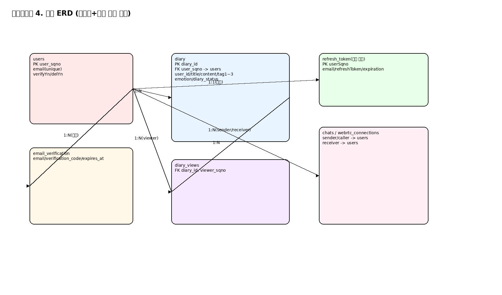
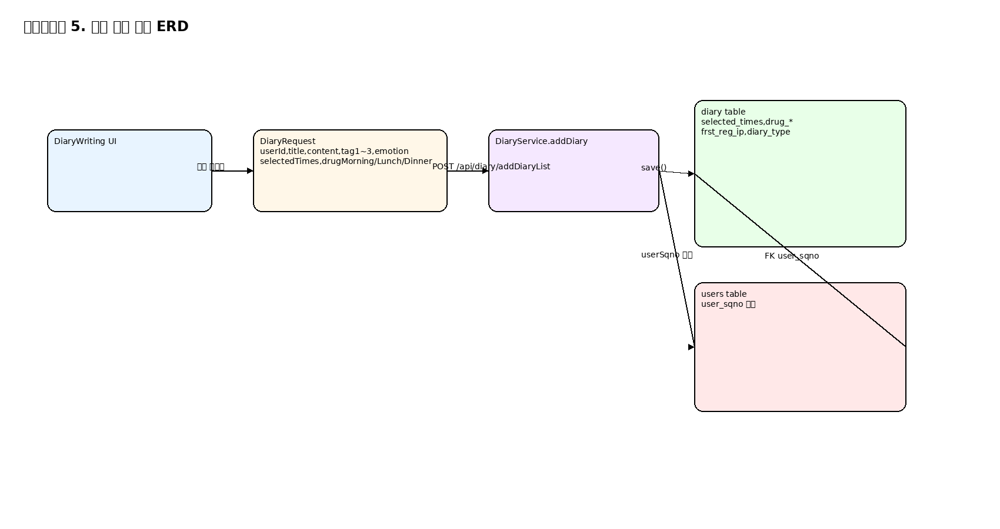

- 전체 ERD는 인증/일기/부가 기능 테이블 간 관계를 한 화면에 보여줍니다.
- 기능별 ERD는 일기 작성 시 UI 필드가 `DiaryRequest -> DiaryService -> diary/users`로 연결되는 경로를 분리해 보여줍니다.

---

## 11. 유지보수 절차

### 11.1 환경 설정
- Backend: Java 17, PostgreSQL(로컬), SMTP 설정 필요.
- Frontend: Node.js + npm, Vite.
- 필수 설정 파일: `/home/runner/work/Diary/Diary/Ai-Diary-server/src/main/resources/application.properties`
  - DB: `spring.datasource.*`
  - JWT: `jwt.secret-key`, `jwt.issuer`
  - SMTP: `spring.mail.*`
  - Kakao: `KAKAO_CLIENT_ID`, `KAKAO_REDIRECT_URI`

### 11.2 로컬 실행
- Backend
  - 위치: `/home/runner/work/Diary/Diary/Ai-Diary-server`
  - 명령: `./mvnw spring-boot:run`
  - 확인: `GET /api/timer/health`가 `OK`
- Frontend
  - 위치: `/home/runner/work/Diary/Diary/Ai-Diary-vue`
  - 명령: `npm install && npm run dev`
  - 확인: 브라우저 홈 라우트 진입

### 11.3 변경 위치 찾기
- 로그인/회원: `page/LoginPage.vue`, `page/SignupPage.vue`, `controller/AuthController.java`, `service/AuthService.java`
- 다이어리: `page/Diary*.vue`, `controller/DiaryController.java`, `service/DiaryService.java`, `diary/domain/*`
- 카카오: `components/LoginView.vue`, `controller/KakaoController.java`, `service/KakaoService.java`
- 공통 인증헤더: `unit/axiosInstance.js`, `util/JwtAuthenticationFilter.java`

### 11.4 테스트/빌드
- Frontend
  - `npm run build`
  - `npm run test:unit`
  - `npm run lint`
- Backend
  - `./mvnw test`
  - `./mvnw package`

### 11.5 배포/복구(저장소 확인 범위)
- 백엔드는 JAR 업로드 후 EC2에서 실행하는 절차가 `Ai-Diary-server/README.md`에 정리되어 있습니다.
- 프런트는 S3/CloudFront, 백엔드는 EC2+Nginx 프록시 구성을 사용한 기록이 루트 README와 서버 README에 존재합니다.
- 복구 시 우선순위: 1) 백엔드 프로세스/JAR 상태 2) DB 연결 3) 프런트 정적 배포 경로 4) Nginx 프록시 라우팅.

---

## 12. 증상별 문제 진단

| 증상 | 1차 확인 | 원인 후보 | 조치 |
|---|---|---|---|
| 프런트 실행 실패 | `npm run dev` 로그 | 라우터 파일명 대소문자 불일치(`ConfirmPassword2.vue`) | 라우터 import와 실제 파일명 정합 확인 |
| 로그인 후 API 401 반복 | Network 탭 + `/api/auth/refresh` 응답 | refresh 쿠키 누락/만료/DB 불일치 | 쿠키 도메인/SameSite/Secure 설정과 `refresh_token` 레코드 점검 |
| 일기 상세가 빈 화면 | URL의 `diaryId`, `userId` | query `userId` 누락 시 호출 중단 | 목록에서 이동 URL 파라미터 전달 확인 |
| 일기 저장 403 | 요청 body `email` vs 인증 사용자 | 요청 이메일/토큰 사용자 불일치 | localStorage 사용자값과 요청 payload 동기화 |
| 카카오 전송 실패 | `/api/kakao/sendRecord` 응답 | Authorization 또는 kakaoAccessToken 누락 | 로그인 상태/토큰 저장 키 점검 |
| 서버는 뜨는데 시간 위젯 미표시 | `/api/timer/now` 호출 | CORS/프록시 경로 문제 | `SecurityConfig` CORS 허용 도메인과 프런트 baseURL 점검 |

---

## 13. 검수 결과

- Markdown 점검
  - 이미지 상대 경로: `./images/...`로 통일, 로컬 렌더링 기준 정상.
  - 내부 링크(목차): 섹션 앵커 기준 연결 확인.
- PDF 점검
  - 본 문서와 동일 제목/내용으로 생성.
  - 페이지별 텍스트/이미지 배치 확인(잘림 최소화 기준).

