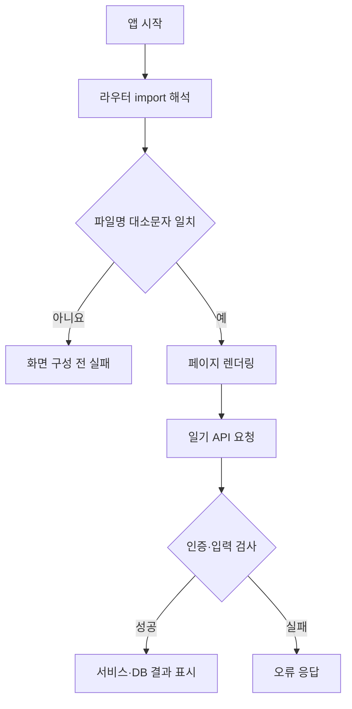

# Diary — screen-code-handover 업데이트 인수인계

한국시간 2026년 9월 18~19일 업데이트 보고서. 활동 집계 마감은 9월 19일 21:24:15입니다.

일기 작성·조회와 인증을 다루는 Vue·Spring 프로젝트입니다. 이번에는 기능별 코드·API·DB 관계와 문제 진단 절차를 담은 인수인계 묶음이 추가됐습니다.

| 항목 | 기준 |
|---|---|
| 보고서 범위 | 이번 기간의 변경과 관련 기능. 전체 시스템 설명은 아래 기존 상세 문서로 연결합니다. |
| 확인 브랜치 | main |
| 소스 기준 | `bcac74c1a1bb` |
| 검증 범위 | router의 대문자 ConfirmPassword2 import와 기준 Git 트리의 소문자 confirmPassword2.vue를 직접 대조했습니다. |
| 보고서 세트 | [쉬운 설명](easy-guide.md) · [수정·검증 지시](fix-guide.md) · [코드 인수인계](screen-code-handover.md) |

## 이번 변경의 경계

- 9월 19일 10:20, PR #3으로 인수인계 Markdown·PDF·화면 재구성 이미지·흐름도와 작업 지도를 추가했습니다.
- 앱 실행 시 발견한 파일 이름 대소문자 차이도 문서에 기록됐습니다. 이 문서 커밋으로 해당 코드가 수정되지는 않았습니다.

기존 보고서의 코드 기반 일기 작성 화면 재구성입니다. 이번 작업에서 새로 실행·캡처한 화면은 아닙니다.

## 핵심 파일과 역할

| 핵심 파일 | 함수·컴포넌트 | 담당 역할 |
|---|---|---|
| [Ai-Diary-vue/src/router/index.js](https://github.com/feed-mina/Diary/blob/bcac74c1a1bb44563bb1e2e55b52be9102f4008e/Ai-Diary-vue/src/router/index.js) | ConfirmPassword2 import 및 라우트 | 비밀번호 확인 화면의 파일을 가져와 주소에 연결합니다. 현재 import와 파일명 대소문자가 다릅니다. |
| [Ai-Diary-server/src/main/java/com/domain/demo_backend/controller/DiaryController.java](https://github.com/feed-mina/Diary/blob/bcac74c1a1bb44563bb1e2e55b52be9102f4008e/Ai-Diary-server/src/main/java/com/domain/demo_backend/controller/DiaryController.java) | 일기 Controller | 로그인 사용자와 일기 요청을 검사하고 서비스 응답을 조립합니다. |
| [docs/handover/maintenance-handover.md](https://github.com/feed-mina/Diary/blob/bcac74c1a1bb44563bb1e2e55b52be9102f4008e/docs/handover/maintenance-handover.md) | 기능별 인수인계 | 로그인·일기·타이머와 서버·데이터 모델을 연결해 설명합니다. |

## 입력·처리·반환과 부수 효과

| 담당 기능 | 입력 | 처리와 분기 | 반환·출력 | 별도로 일어나는 변경 |
|---|---|---|---|---|
| 화면 import | @/page/ConfirmPassword2.vue | 실제 경로에서 파일 탐색 | 컴포넌트 모듈 또는 해석 실패 | 화면 시작 가능 여부 결정 |
| 일기 저장 | 일기 요청과 로그인 사용자 | 요청 사용자 일치 여부 확인 후 서비스에 전달 | 저장 결과 응답 | 일기 DB 쓰기 |
| 일기 조회 | 일기 ID·사용자 조건 | 서비스 조회 결과 조립 | 목록 또는 상세 응답 | DB 읽기 |

## 동작 흐름

화살표는 호출·데이터 전달 또는 조건 분기를 뜻합니다. 도식에 없는 운영 연결은 확인되지 않았습니다.

## 데이터와 연결 관계

| 저장·전달 대상 | 주요 값 | 관계와 주의점 |
|---|---|---|
| 파일 연결 | ConfirmPassword2.vue / confirmPassword2.vue | 같은 파일로 가정하지 않습니다. |
| 일기 모델 | 기존 보고서의 users·diary 관계 | 사용자와 일기 저장 경로를 기존 상세 ERD에서 확인합니다. |
| 인증 정보 | 요청 신원과 일기 작성자 | 화면에서 보내는 값만 신뢰하지 않고 서버 검사와 함께 봅니다. |

## 유지보수와 확인 순서

| 바꾸거나 확인할 것 | 확인 위치와 기준 |
|---|---|
| 파일명 변경 | Git의 실제 경로와 모든 import를 함께 갱신합니다. |
| 화면 검수 | 컴파일 성공 후 비밀번호 확인 라우트까지 직접 엽니다. |
| 문서 캡처 | 재구성 이미지라는 표기를 유지하고 실제 실행 결과와 혼합하지 않습니다. |

프런트엔드 작업 폴더는 Ai-Diary-vue이며 빌드 명령은 `npm run build`입니다. 전체 의존성을 설치한 사본에서 대소문자 구분 환경으로 확인합니다.

## 검증 결과와 남은 범위

router의 대문자 ConfirmPassword2 import와 기준 Git 트리의 소문자 confirmPassword2.vue를 직접 대조했습니다.

이번에는 Vite 전체 빌드와 서버·DB·로그인을 실행하지 않았습니다. 기존 문서의 실행 실패 기록과 이번 정적 대조를 구분합니다.

## 기존 상세 문서와 활동 근거

- [전체 인수인계](https://github.com/feed-mina/Diary/blob/bcac74c1a1bb44563bb1e2e55b52be9102f4008e/docs/handover/maintenance-handover.md)

| 한국시간 | 커밋 | 기록된 작업 | 구분 |
|---|---|---|---|
| 09/19 10:20 | [bcac74c](https://github.com/feed-mina/Diary/commit/bcac74c1a1bb44563bb1e2e55b52be9102f4008e) | Merge pull request #3 from feed-mina/copilot/screen-code-handover | 병합 기록 |
| 09/19 10:17 | [c6fab05](https://github.com/feed-mina/Diary/commit/c6fab05383a51bdc180060152dced58f9b8ac9d0) | docs: work-map-guide HTML 보고서 추가 | 변경 기록 |
| 09/19 10:16 | [abe9964](https://github.com/feed-mina/Diary/commit/abe9964937f7f32e34610259d0b9ba5944d571a4) | docs: 유지보수 및 인수인계 문서와 PDF/이미지 추가 | 변경 기록 |
| 09/19 10:10 | [0253219](https://github.com/feed-mina/Diary/commit/025321914790777eadbdde3d20c35c3059603cf1) | docs: 시작 전 인수인계 문서 작성 계획 수립 | 변경 기록 |
